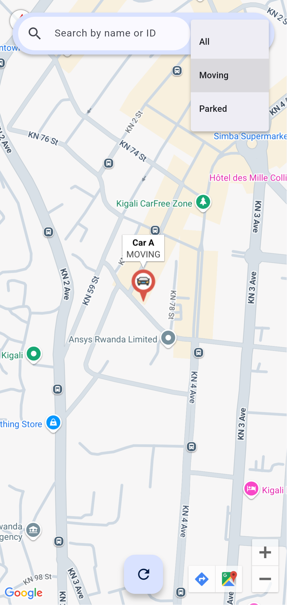

# 🚗 Fleet Watch App

![coverage][coverage_badge]
[![style: very good analysis][very_good_analysis_badge]][very_good_analysis_link]
[![License: MIT][license_badge]][license_link]

Generated by the [Very Good CLI][very_good_cli_link] 🤖

A Flutter application that tracks and displays cars on a map in real-time, allows viewing car details, and supports offline mode with local caching.

---

## 📱 Features

- Real-time map view with car markers  
- Tap on markers to view car details  
- Live tracking of individual cars  
- Search and filter by car name or status (Moving/Parked)  
- Offline support with cached data  

---

## 🔗 Technologies Used

- Flutter SDK
- Flutter Bloc
- Equatable
- Google Maps Flutter
- Hive Community Edition
- Flutter Icon Launcher

---

## ⚠️ Limitations

- **No official design/mockup**  
  Having no provided design or mockup, a significant amount of time was spent imagining the app’s interface and user experience.

- **Simulated data only**  
  Creating mock car data (latitudes/longitudes) was challenging, especially to achieve a realistic spread of positions on the map. The points may appear clustered or less dispersed than in a real-world scenario.

---

## 📹 Demo Video

[🎥 Watch Full Demo on MEGA](https://mega.nz/file/cw9UTBDD#b2Ed-Z6upaveOiCSssuDsbJeaqZ-AxV_hSY-gBYqMdM)

---

## 🖥️ Screenshots

<div style="text-align: center">
    <table>
        <tr>
            <td style="text-align: center">
                <strong>Home Screen - Map View</strong> <br>
                Shows all cars on a map using Google Maps.
            </td> 
            <td style="text-align: center">
                <strong>Home Screen - Search</strong> <br>
                Search bar to find cars by name or ID.
            </td> 
            <td style="text-align: center">
                <strong>Home Screen - Filter</strong> <br>
                Filter to show only "Moving" or "Parked" cars.
            </td> 
        </tr>
        <tr>
            <td style="text-align: center">
                <a href="screenshots/1_home_map.png">
                    
                </a>
            </td>            
            <td style="text-align: center">
                <a href="screenshots/2_home_search.png">
                    
                </a>
            </td>
            <td style="text-align: center">
                <a href="screenshots/3_home_filter.png">
                    
                </a>
            </td>
        </tr>
        <tr>
            <td style="text-align: center">
                <strong>Car Detail View</strong> <br>
                Displays car name, speed, and last known <br>
		location with a mini-map.
            </td> 
            <td style="text-align: center">
                <strong>Car Tracking Activated</strong> <br>
                Shows live tracking on mini-map when enabled.
            </td> 
            <td style="text-align: center">
                <strong>Offline Mode</strong> <br>
                Indicates when the device is offline and <br>
		data is loaded from local storage.
            </td> 
        </tr>
        <tr>
            <td style="text-align: center">
                <a href="screenshots/4_car_detail_1.png">
                    
                </a>
            </td>
            <td style="text-align: center">
                <a href="screenshots/5_car_detail_2.png">
                    
                </a>
            </td>
            <td style="text-align: center">
                <a href="screenshots/6_home_offline.png">
                    
                </a>
            </td>
        </tr>
    </table>
</div>

---

## Getting Started 🚀

Follow the steps below to run the app locally:

### 1. Clone the Repository

```bash
git clone https://github.com/ardinbig/fleet-watch.git
cd fleet-watch
```

### 2. Run the Project

This project contains 3 flavors:

- development
- staging
- production

To run the desired flavor either use the launch configuration in VSCode/Android Studio or use the following commands:

```sh
# Development
$ flutter run --flavor development --target lib/main_development.dart

# Staging
$ flutter run --flavor staging --target lib/main_staging.dart

# Production
$ flutter run --flavor production --target lib/main_production.dart
```

_\*Fleet Watch works on iOS and Android._

---

## Running Tests 🧪

To run all unit and widget tests use the following command:

```sh
$ flutter test --coverage --test-randomize-ordering-seed random
```

To view the generated coverage report you can use [lcov](https://github.com/linux-test-project/lcov).

```sh
# Generate Coverage Report
$ genhtml coverage/lcov.info -o coverage/

# Open Coverage Report
$ open coverage/index.html
```

---

## Working with Translations 🌐

This project relies on [flutter_localizations][flutter_localizations_link] and follows the [official internationalization guide for Flutter][internationalization_link].

### Adding Strings

1. To add a new localizable string, open the `app_en.arb` file at `lib/l10n/arb/app_en.arb`.

```arb
{
    "@@locale": "en",
    "fleetWatchTitle": "Fleet Watch",
    "@fleetWatchTitle": {
        "description": "Text shown in the AppBar of the Fleet Watch Page"
    },
}
```

2. Then add a new key/value and description

```arb
{
    "@@locale": "en",
    "fleetWatchTitle": "Fleet Watch",
    "@fleetWatchTitle": {
        "description": "Text shown in the AppBar of the Fleet Watch Page"
    },
    "helloWorld": "Hello World",
    "@helloWorld": {
        "description": "Hello World Text"
    }
}
```

3. Use the new string

```dart
import 'package:fleet_watch/l10n/l10n.dart';

@override
Widget build(BuildContext context) {
  final l10n = context.l10n;
  return Text(l10n.helloWorld);
}
```

### Adding Supported Locales

Update the `CFBundleLocalizations` array in the `Info.plist` at `ios/Runner/Info.plist` to include the new locale.

```xml

<key>CFBundleLocalizations</key>
<array>
	<string>en</string>
	<string>fr</string>
</array>

```

### Generating Translations

To use the latest translations changes, you will need to generate them:

```sh
flutter gen-l10n --arb-dir="lib/l10n/arb"
```

_💡 Make sure you have a device/emulator with Google Play services for the Google Maps plugin._

Alternatively, run `flutter run` and code generation will take place automatically.


[coverage_badge]: coverage_badge.svg
[flutter_localizations_link]: https://api.flutter.dev/flutter/flutter_localizations/flutter_localizations-library.html
[internationalization_link]: https://flutter.dev/docs/development/accessibility-and-localization/internationalization
[license_badge]: https://img.shields.io/badge/license-MIT-blue.svg
[license_link]: https://opensource.org/licenses/MIT
[very_good_analysis_badge]: https://img.shields.io/badge/style-very_good_analysis-B22C89.svg
[very_good_analysis_link]: https://pub.dev/packages/very_good_analysis
[very_good_cli_link]: https://github.com/VeryGoodOpenSource/very_good_cli
